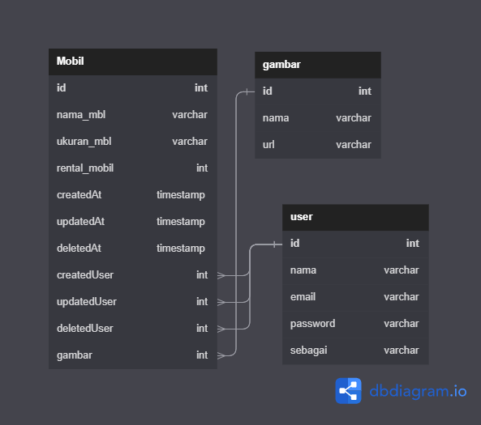

# FSW3_Aisyawldr_Chapter6
# BCR - Car Management API (OpenAPI 3.0)

Fullstack Web Challenge Chapter 6 [Binar Academy - Studi Independen Kampus Merdeka Batch 3 - 2022]
Pada Challenge Chapter 6 ini mengenai Car Management API (OpenAPI 3.0)

Pada Challenge Chapter 6 hal yang harus diKuasi yaitu mengenai :
1. Design Pattern 
   ● Design Pattern
   ● MVC (Model View Controller) 
   ● Service Repository Pattern 
   ● Microservice Pattern

2. Asynchronous Process 
   ● Process 
   ● Synchronous Process & Asynchronous Process 
   ● Callback 
   ● Promises

3. Authentication 
   ● Authentication 
   ● Encryption 
   ● Authorization 
   ● Session Based Authentication 
   ● Token Based Authentication

4. Open API 
   ● Dokumentasi API 
   ● Struktur dokumen Open API 
   ● Open API Tools 
   ● Swagger UI & Redoc in Express 
   ● Mock UP API

## Setup Server

    npm install

    Setting File database.js 
   ● db:create
   ● db:migrate
   ● db:seed

Setelah konfigurasi selesai, jalankan perintah berikut untuk menyelesaikan pengaturan server dengan satu perintah:

    npm run setup

Jika ada masalah dengan perintah diatas, Anda dapat menjalankan serangkaian perintah ini sebagai gantinya:

    sequelize db:drop
    sequelize db:create
    sequelize db:migrate
    sequelize db:seed:all

Rerun either of these commands to fresh reset the server database.

## About Superadmin Account

Superadmin account 

    name: Mr.Superadmin
    email: aisyawulandari96@gmail.com
    password: admin12

To change the default account details, the configuration files are available on `config/superadmin.js`. To apply changes to superadmin account configuration, run the following one-line command:

    npm run superadmin

## Run Server

To run the server in normal mode, run the following command:

    npm start

To run the server in development mode, run the following command instead:

    npm run develop

Server will run at `http://localhost:8000` by default.

## API Documentation

Open API : http://localhost:8000
Swagger UI : http://localhost:8000/apiDocument

## Design Database 

